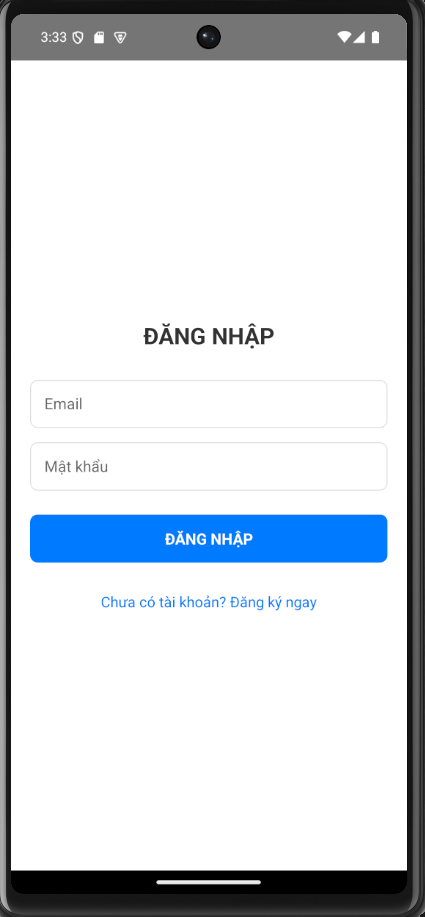
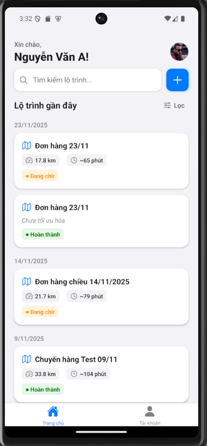
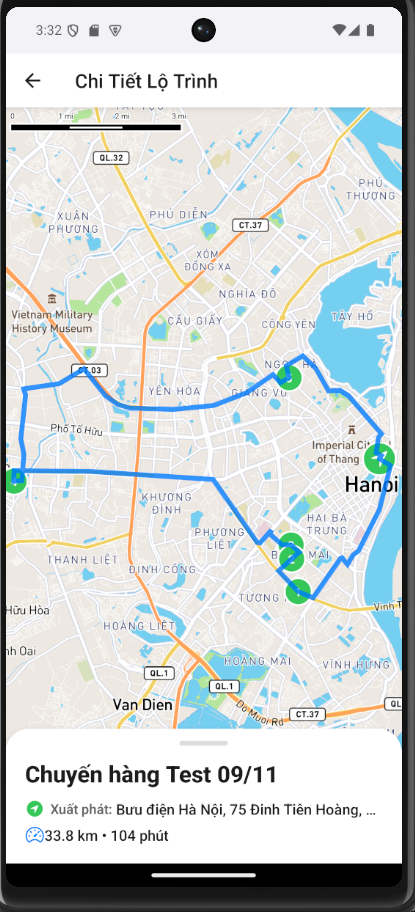

# 📱 Shipper Route Optimization App (Frontend)


> **Ứng dụng di động tối ưu hóa lộ trình giao hàng dành cho Shipper.**

Dự án này là phần Frontend được xây dựng bằng **React Native**, kết nối với Backend (Node.js/MySQL) để cung cấp giải pháp quản lý đơn hàng, tối ưu hóa đường đi thông minh qua Mapbox và thống kê hiệu suất làm việc cho tài xế.

---

## 📸 Hình ảnh minh họa (Screenshots)

| Màn hình Đăng nhập | Trang chủ (Dashboard) | Chi tiết Lộ trình |
|:---:|:---:|:---:|
|  |  |  |


---

## ✨ Tính năng nổi bật (Key Features)

### 1. 🔐 Xác thực & Người dùng (Authentication)
* **Đăng ký/Đăng nhập:** Hỗ trợ nhập liệu đầy đủ thông tin (Họ tên, SĐT, Phương tiện).
* **Auto-login:** Tự động đăng nhập khi mở app nhờ cơ chế lưu trữ Token an toàn (`AsyncStorage`).
* **Session Management:** Tự động phát hiện Token hết hạn (401 Unauthorized) và yêu cầu đăng nhập lại.

### 2. 📦 Quản lý Lộ trình (Route Management)
* **Danh sách thông minh:** Hiển thị lộ trình nhóm theo **Ngày tạo** (`SectionList`).
* **Tìm kiếm & Lọc:** * Tìm kiếm Real-time theo tên hoặc địa chỉ.
    * Bộ lọc nâng cao: *Tất cả / Đang chờ / Hoàn thành*.
    * Sắp xếp: *Mới nhất / Cũ nhất*.
* **Real-time Update:** Sử dụng `DeviceEventEmitter` để đồng bộ dữ liệu tức thì giữa màn hình Chi tiết và Trang chủ (không cần reload lại app).

### 3. 🗺️ Bản đồ & Tối ưu hóa (Map & Optimization)
* **Mapbox Integration:** Hiển thị bản đồ trực quan, mượt mà.
* **Marker & Polyline:** Vẽ điểm xuất phát, các điểm dừng và đường đi nối liền.
* **Sliding Panel:** Danh sách điểm dừng dạng trượt, dễ dàng thao tác thêm/xóa/sửa.
* **Route Optimization:** Tính năng "Tối ưu ngay" gọi API backend để sắp xếp lại thứ tự giao hàng ngắn nhất.

### 4. 📊 Hồ sơ & Thống kê (Profile & Stats)
* **Dashboard cá nhân:** Thống kê:
    * Số ngày hoạt động.
    * Tổng số đơn hàng giao thành công.
    * Tổng quãng đường di chuyển (Km).
    * Đánh giá trung bình (Rating).
* **Chỉnh sửa thông tin:** Cập nhật SĐT, loại xe, họ tên với cơ chế Hoàn tác/Lưu.

---

## 🛠️ Công nghệ sử dụng (Tech Stack)

* **Core:** React Native (0.74.x)
* **Navigation:** React Navigation (Native Stack, Bottom Tabs)
* **Maps:** `@rnmapbox/maps` (Mapbox SDK)
* **State & Storage:** React Hooks (`useState`, `useEffect`, `useMemo`), `AsyncStorage`
* **Network:** `axios` (API Client)
* **UI Components:** `react-native-vector-icons`, `rn-sliding-up-panel`, `react-native-safe-area-context`
* **Utils:** `jwt-decode` (Xử lý Token), `DeviceEventEmitter` (Event Bus)

---

## 📂 Cấu trúc Thư mục (Project Structure)

```text
src/
├── assets/             # Các image cần sử dụng
├── components/         # Các Component tái sử dụng (FilterModal, RouteSheet...)
├── hooks/              # Custom Hooks (useRouteFilter...)
├── navigation/         # Cấu hình điều hướng (AppNavigator, AuthStack, MainTab...)
├── screens/            # Các màn hình chính
│   ├── AuthScreen.js
│   ├── HomeScreen.js
│   ├── ProfileScreen.js
│   ├── RouteDetailScreen.js
│   └── CreateRouteScreen.js
├── utils/              # Các hàm tiện ích (Colors, FormatDate...)
└── App.tsx             # Entry point & Logic kiểm tra Token
```

## 🚀 Cài đặt và Chạy dự án (Installation)
### 1. Yêu cầu tiên quyết
* Node.js (>= 18.x)
* JDK 17
* Android Studio (cho Android) hoặc Xcode (cho iOS)
* Tài khoản Mapbox (để lấy Access Token)

## 2. Cài đặt
Bước 1: Clone dự án

```Bash
git clone https://github.com/Dinhthuy2k5/ShipperApp-new.git
cd ShipperApp
```

Bước 2: Cài đặt thư viện

```Bash
npm install
# Hoặc
yarn install
```

Bước 3: Cấu hình Mapbox

Tạo file .env (hoặc cấu hình trực tiếp trong android/app/src/main/res/values/strings.xml nếu dùng Android).
Thêm Key Mapbox của bạn vào src/components/RouteDetailMap.js (hoặc nơi bạn cấu hình Mapbox).

Bước 4: Chạy ứng dụng

Android:

```Bash
npm run android
```

iOS:

```Bash
cd ios && pod install && cd ..
npm run ios
```

⚠️ Các vấn đề thường gặp (Troubleshooting)
* Lỗi kết nối API (Network Error):
* Nếu chạy trên máy ảo Android (Emulator), hãy đảm bảo API_URL là http://10.0.2.2:3000.
* Nếu chạy trên máy thật, hãy dùng địa chỉ IP LAN của máy tính (VD: http://192.168.1.x:3000).
* Lỗi Mapbox không hiển thị:

     * Kiểm tra lại MAPBOX_ACCESS_TOKEN.

     * Đảm bảo đã cấp quyền Vị trí (Location Permission) cho ứng dụng.

## 👨‍💻 Tác giả
Nguyễn Đình Thủy

MSSV: 20235437

Dự án: Project 1 - Đại học Bách Khoa Hà Nội